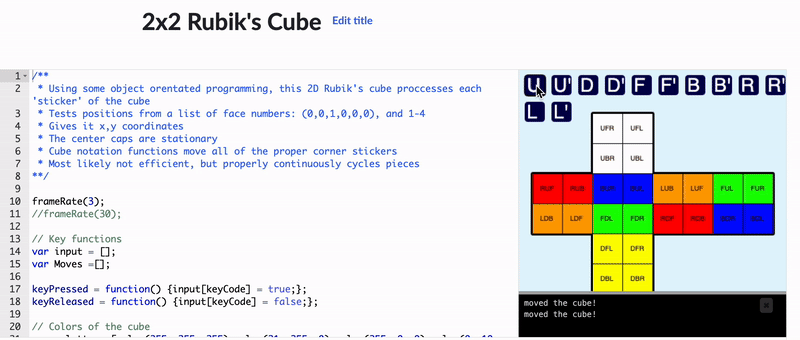

# 2x2 Rubiks Cube

2x2 Rubiks Cube program written in JavaScript. Built for the Khan Academy P5.js library.

Source: https://www.khanacademy.org/computer-programming/2x2-rubiks-cube/5452306788745216

